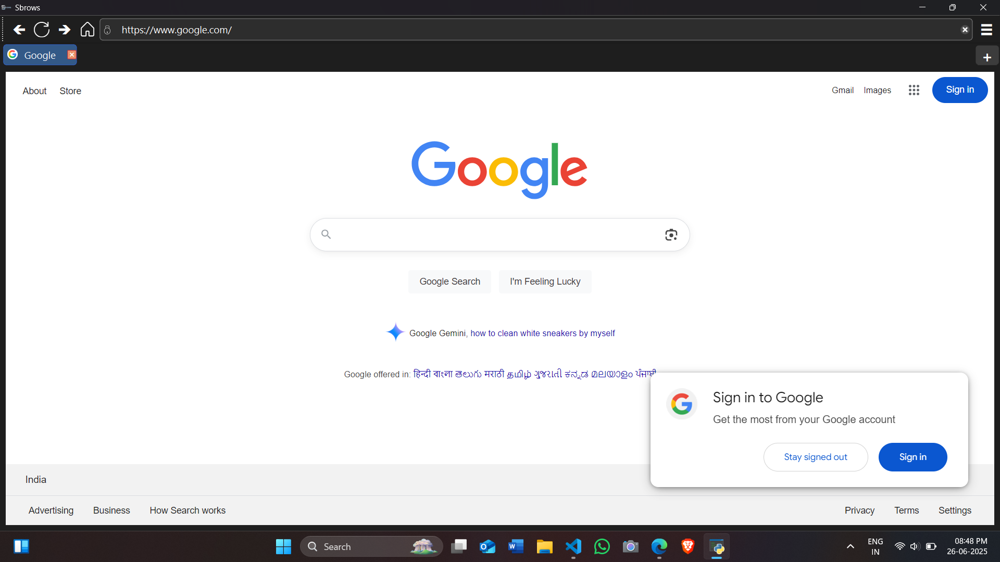

# 🌐 Sbrows – Lightweight PyQt6-Powered Web Browser



**Sbrows** is a fully functional, lightweight web browser built with [PyQt6](https://www.riverbankcomputing.com/software/pyqt/intro) and QtWebEngine. It offers tabbed browsing, privacy features like ad blocking and cookie control, and a sleek sidebar interface. Designed for performance, privacy, and extensibility — all in Python.

---

## 🚀 Features

✅ **Tabbed Browsing**  
✅ **Built-in Ad Blocker** (domain + pattern based)  
✅ **Download Manager** with Progress Dialog  
✅ **Cookie Management** (view/set/clear)  
✅ **Media Permission Handling** (mic/camera prompts)  
✅ **History Panel** with delete and clear options  
✅ **URL Auto-Complete** from `links.txt`  
✅ **Custom Sidebar** with tab controls, privacy options, and history  
✅ **New Window Support**  
✅ **Modern UI** with Unicode icons & styled tabs  
✅ **HTTPS Indicator Icons** 🔒🔓  

---

## 📸 Screenshots

> _Coming soon — or add your own preview image like `preview.png`_

---

## 🛠️ Setup Instructions

### 🔧 Requirements
- Python 3.9+
- PyQt6
- PyQt6-WebEngine

Install dependencies via pip:

```bash
pip install PyQt6 PyQt6-WebEngine
